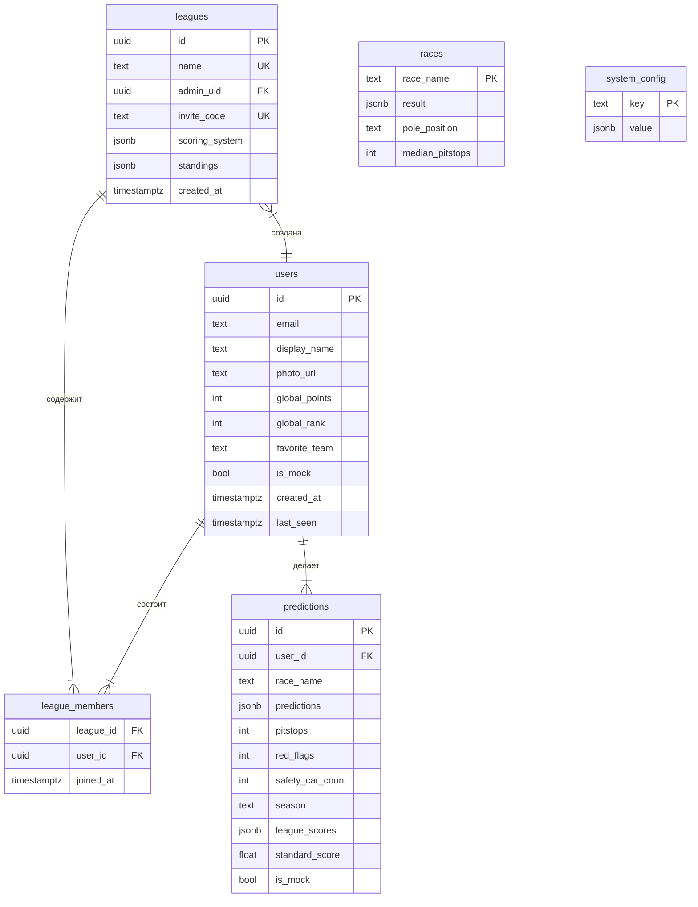

# 🏎️ F1 Predictions Oracle — Обзор проекта

> Проект для предсказания результатов гонок Формулы 1, соревнования с друзьями в лигах и зарабатывания достижений.

---

## 📌 Основная идея

**F1 Predictions Oracle** — это веб-приложение, позволяющее фанатам F1:
- **Предсказывать** результаты гонок (Топ-10 финишёров, пит-стопы, сейфти-кар, поул-позицию и т. д.)
- **Создавать лиги** и соревноваться с друзьями по очкам
- **Получать достижения** (медали, серии, чемпионские титулы)
- **Просматривать статистику** — глобальные рейтинги, тренды очков, турнирную таблицу по сезону

---

## 🧱 Стек технологий

| Технология | Назначение |
|---|---|
| **React 17** (Create React App) | UI-фреймворк |
| **Redux Toolkit** | Глобальное состояние (пользователь, прогнозы, расписание, лиги) |
| **React Router v6** | Клиентская маршрутизация |
| **Supabase** *(текущий бэкенд)* | Аутентификация (Google OAuth), PostgreSQL база данных, RLS-политики |
| **Firebase** *(легаси, в процессе миграции)* | Предыдущий бэкенд (Firestore + Auth) |
| **TailwindCSS + Bootstrap** | Стилизация — «F1 Night» тема (тёмный режим, красные акценты, glassmorphism) |
| **OpenF1 API** | Данные гонок — расписание, результаты, позиции пилотов |
| **Ergast API** | Резервный источник исторических данных F1 |

---

## 📁 Структура проекта

```
f1_predictions/
├── database/
│   └── setup.sql              # Схема БД (Supabase PostgreSQL)
├── public/                     # Статические файлы
├── src/
│   ├── App.js                  # Главный компонент, маршрутизация
│   ├── index.js                # Точка входа React
│   ├── App.css                 # Глобальные стили
│   ├── config/
│   │   └── supabase.js         # Клиент Supabase + хелперы
│   ├── redux/
│   │   ├── store.js            # Redux store
│   │   ├── reducer_supabase.js # ✅ Активный редьюсер (Supabase)
│   │   ├── reducer.js          # 🔸 Легаси редьюсер (Firebase)
│   │   └── firebase_config.js  # 🔸 Легаси конфиг Firebase
│   ├── Components/
│   │   ├── Admin/              # Панель администратора
│   │   ├── Login/              # Авторизация (Login + Signup)
│   │   ├── Header/             # Навигация
│   │   ├── Footer/             # Футер
│   │   ├── Logo/               # Логотип
│   │   ├── ProtectedRoute.jsx  # Защита маршрутов
│   │   └── Main/               # Основные страницы (см. ниже)
│   ├── hooks/
│   │   └── useAchievements.js  # Хук расчёта достижений
│   ├── utils/
│   │   ├── scoringUtils.js     # Логика подсчёта очков
│   │   ├── achievementUtils.js # Определения и расчёт достижений
│   │   ├── leagueStatsUtils.js # «Весёлая» статистика лиг
│   │   ├── TeamColors.js       # Цвета команд F1
│   │   ├── geoUtils.js         # GeoJSON → SVG для трасс
│   │   ├── circuitStats.js     # Статистика трасс
│   │   ├── SimulatorService.js # Сервис подставных данных (тестирование)
│   │   └── tests/              # Unit-тесты (5 файлов)
│   ├── f1-circuits-data/       # GeoJSON-данные трасс (52 файла)
│   └── images/                 # Изображения
├── MIGRATION_GUIDE.md          # Инструкция миграции Firebase → Supabase
├── SUPABASE_SETUP.md           # Настройка Supabase
├── NEXT_STEPS.md               # Дорожная карта
├── package.json
└── tailwind.config.js
```

---

## 🗺️ Маршруты (Routes)

| Путь | Компонент | Доступ | Описание |
|---|---|---|---|
| `/` | `Login` | Публичный | Страница входа |
| `/signup` | `Signup` | Публичный | Регистрация |
| `/home` | `Home` | 🔒 | Главная: герой-блок, следующий этап, календарь сезона |
| `/my-predictions` | `MyPredictions` | 🔒 | Создание прогнозов на гонку |
| `/leagues` | `Leagues` | 🔒 | Управление лигами, таблица |
| `/leaderboard` | `LeaderboardHub` | 🔒 | Общий лидерборд, результаты ГП |
| `/profile` | `Profile` | 🔒 | Профиль пользователя, достижения, графики |
| `/settings` | `Settings` | 🔒 | Настройки (тема, профиль) |
| `/achievements` | `Achievements` | 🔒 | Витрина достижений |
| `/championship/:stage` | `Stage` | 🔒 | Этап чемпионата |
| `/championship/race/:year/:sessionKey` | `GrandPrixDetail` | 🔒 | Детали гонки |
| `/driver/:year/:driverId` | `DriverDetail` | 🔒 | Страница пилота |
| `/admin` | `AdminPanel` | 🔒 Admin | Панель администратора |

---

## 📊 Компоненты — детальное описание

### 🏠 Home (`Components/Main/Home/`)
- **Home.js** — главная страница со ссылками, объявлениями, расписанием
- **HomeHero.jsx** — динамический герой-блок с данными о следующей гонке
- **TrackTeaser.jsx** — визуализация трассы (SVG из GeoJSON)
- **Calendar/** — интерактивный календарь сезона F1

### 🎯 MyPredictions (`Components/Main/MyPredictions/`)
- **MyPredictions.js** — форма для создания прогноза: выбор пилотов (drag-and-drop), пит-стопы, красные флаги, сейфти-кар, поул-позиция

### 🏆 Championship (`Components/Main/Championship/`)
- **LeaderboardHub.jsx** — центр лидерборда, таблица результатов
- **Standings/** — турнирная таблица сезона
- **Results/** — общие результаты (OverallResults), результаты по этапам
- **GrandPrixDetail/** — детальная страница гонки
- **DriverDetail/** — страница с данными о пилоте
- **Timings/** — тайминги сессий

### ⚔️ Leagues (`Components/Main/Leagues/`)
- **LeagueManager.jsx** (901 строк) — полное управление лигами:
  - Создание лиги с пользовательскими правилами начисления очков
  - Присоединение по инвайт-коду
  - Просмотр участников с онлайн-статусом
  - Подсчёт очков по гонкам
  - «Весёлая статистика» (любимый пилот, «weirdo», «money maker»)
  - Просмотр прогнозов других участников
- **SeasonStandings.jsx** — итоговая таблица сезона с обработкой tied-рангов

### 👤 Profile (`Components/Main/Profile/`)
- **Profile.jsx** — основной макет профиля с боковой панелью
- **ProfileMainSection/** — основная часть: тренды очков (SVG-графики), витрина достижений
- **Achievements.jsx** — полноэкранная витрина медалей
- **LastPrediction.jsx** — последний сделанный прогноз с разбором очков
- **LastRace.jsx** — детали последней гонки
- **Settings.jsx** — настройки (тёмная/светлая тема, редактирование профиля)

### 🔧 Admin (`Components/Admin/`)
Доступна только администратору (проверка email).

| Вкладка | Файл | Назначение |
|---|---|---|
| Dashboard | `AdminStats.jsx` | Статистика: кол-во пользователей, прогнозов, лиг |
| Race Control | `RaceControl.jsx` | Ручной ввод результатов гонки, подсчёт очков |
| Broadcast | `BroadcastControl.jsx` | Глобальные объявления |
| Simulator | `Simulator.jsx` | Создание тестовых данных (mock-пользователи, прогнозы) |
| User Inspector | `UserInspector.jsx` | Поиск и просмотр профилей пользователей |

---

## ⚙️ Система начисления очков (`scoringUtils.js`)

### Два режима подсчёта:

#### 1. Radius error (по умолчанию)
Очки = `max(0, MAX_POINTS - abs(predictedPos - actualPos))`
- Пилот на точной позиции → максимум (10 за P1, 9 за P2, ..., 1 за P10)
- Ошибка в ±1 позицию — минус 1 очко
- Если пилот вне Топ-10 — 0 очков (или +1 бонус если он в Топ-10 результата)

#### 2. Position-only (для бейджей)
Очки только за точные совпадения позиций.

### Бонусные категории:
| Категория | Описание |
|---|---|
| **Pitstops** | Угадать медианное кол-во пит-стопов (±1) → до 3 очков |
| **Safety Car** | Угадать кол-во сейфти-каров → 2 очка |
| **Red Flags** | Угадать кол-во красных флагов → 3 очка |
| **Pole Position** | Угадать кто возьмёт поул → 3 очка |
| **Fastest Lap** | Угадать быстрейший круг → 2 очка |

### Настраиваемые правила лиг
Каждая лига может иметь собственную систему начисления очков (JSONB в `leagues.scoring_system`).

---

## 🏅 Система достижений (`achievementUtils.js`)

| Достижение | Условие |
|---|---|
| **Track Group Medals** (Power / Street / Precision) | Лучший результат в определённой группе трасс |
| **Pitstop Master** | Серия ≥ 5 корректных прогнозов пит-стопов подряд |
| **Monaco Podium** | Угадать точный Топ-3 любой гонки |
| **Mr. Consistency** | Дисперсия очков ≤ 3 за 5 последних гонок |
| **Pole King** | ≥ 3 корректных прогноза поул-позиций |
| **League Champion** | Стать победителем лиги |
| **Constructor Medals** | Медаль за команду, чьи пилоты принесли вам больше всего очков |

---

## 🗃️ Схема базы данных (Supabase / PostgreSQL)



Все таблицы защищены **Row Level Security (RLS)** — пользователь может изменять только свои данные.

---

## 🌐 Внешние API

### OpenF1 API (`api.openf1.org`)
- `GET /v1/sessions` — расписание сессий (FP1, Qualy, Race)
- `GET /v1/drivers` — список пилотов текущего сезона
- `GET /v1/position` — позиции по итогам сессий

### Ergast API (`ergast.com/api/f1`) — резервный
- Исторические результаты гонок (2022–2025)
- Используется когда OpenF1 не возвращает данные

---

## 🔄 Состояние приложения (Redux)

```javascript
state.user = {
  user: { id, email, displayName, photoURL, globalPoints, globalRank, ... },
  bets: [...],       // Прогнозы текущего пользователя
  drivers: [...],    // Список пилотов F1
  schedule: [...],   // Расписание сезона
  leagues: [...],    // Лиги пользователя
  theme: 'dark',     // Тема UI
  scheduleStatus: 'idle' | 'loading' | 'succeeded' | 'failed'
}
```

Основные async-экшены в `reducer_supabase.js`:
- `signInWithGoogle` / `signOut` — авторизация
- `fetchUserProfile` / `createUserProfile` — профиль
- `fetchDriverStandings` — список пилотов (OpenF1 → fallback)
- `fetchSchedule` — расписание сезона
- `savePrediction` / `deletePrediction` / `fetchBets` — прогнозы
- `createLeague` / `joinLeague` / `deleteLeague` / `searchLeagues` / `fetchUserLeagues` — лиги

---

## 🧪 Тестирование

Юнит-тесты расположены в `src/utils/tests/`:

| Файл | Покрытие |
|---|---|
| `scoringUtils.test.js` | Все режимы расчёта очков, edge-кейсы |
| `achievementUtils.test.js` | Все типы достижений |
| `leagueStatsUtils.test.js` | «Весёлая» статистика лиг |
| `geoUtils.test.js` | Конвертация GeoJSON → SVG |
| `TeamColors.test.js` | Маппинг цветов команд |

Запуск: `npm test`

---

## 🚀 Быстрый старт

```bash
# 1. Клонировать репозиторий
git clone https://github.com/AlexisVanchez/F1-Predictions.git
cd f1_predictions

# 2. Установить зависимости
npm install

# 3. Настроить переменные окружения
# Создать .env.local с:
#   REACT_APP_SUPABASE_URL=<your-url>
#   REACT_APP_SUPABASE_ANON_KEY=<your-key>

# 4. Настроить базу данных
# Выполнить database/setup.sql в SQL Editor Supabase

# 5. Запустить
npm start
# → http://localhost:3000
```

---

## ⚠️ Текущее состояние миграции

Проект **в процессе миграции** с Firebase на Supabase:

| Компонент | Статус |
|---|---|
| Аутентификация (Google OAuth) | ✅ Supabase |
| Профили пользователей | ✅ Supabase |
| Лиги (CRUD + вступление) | ✅ Supabase |
| Прогнозы (CRUD) | ✅ Supabase |
| Расписание и пилоты | ✅ Supabase reducer (API) |
| Admin: Race Control | 🔸 Firebase (reducer.js) |
| Admin: Stats, Broadcast | 🔸 Firebase (reducer.js) |
| Home: глобальные сообщения | 🔸 Firebase (firestore) |
| Результаты гонок и подсчёт | 🔸 Firebase (reducer.js) |

> [!IMPORTANT]
> `store.js` сейчас импортирует `reducer_supabase.js`. Компоненты, которые ещё используют `firestore` напрямую (Home.js, AdminPanel), нуждаются в миграции.

Подробная инструкция: см. [MIGRATION_GUIDE.md](file:///c:/Users/daks9/OneDrive/Рабочий стол/F1/f1_predictions/MIGRATION_GUIDE.md)

---

## 🎨 Дизайн-система «F1 Night»

- **Основной фон**: `#0b0c10` (почти чёрный)
- **Акцентный цвет**: `#dc2626` (красный, brand F1)
- **Карточки**: `bg-gray-900/50 backdrop-blur-md border border-gray-800 rounded-xl`
- **Типографика**: bold italic uppercase tracking-widest
- **Эффекты**: glassmorphism, градиенты, hover-анимации, pulse-эффекты
- **Поддержка светлой темы**: переключение в Settings
